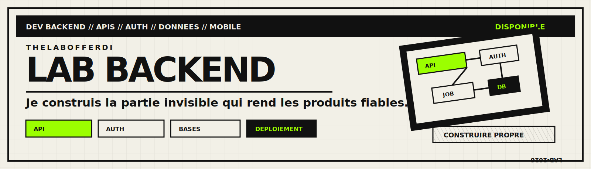
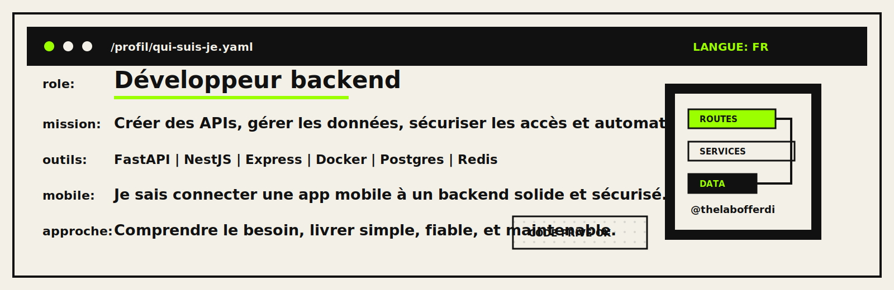
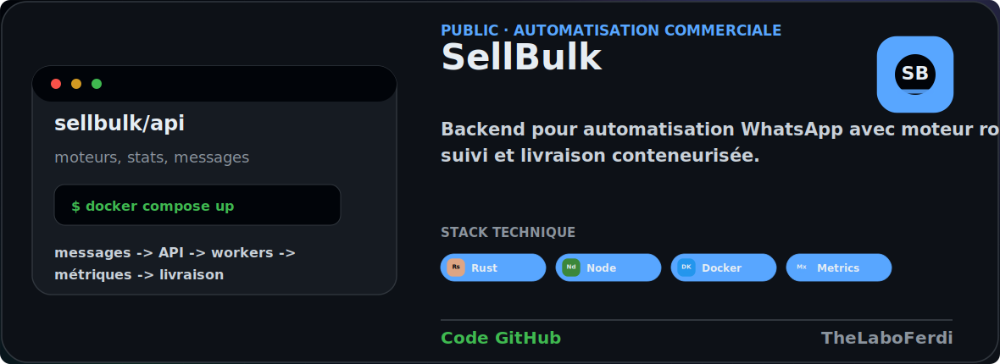
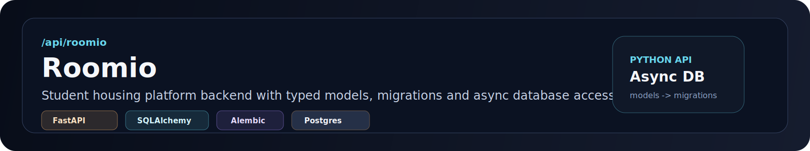
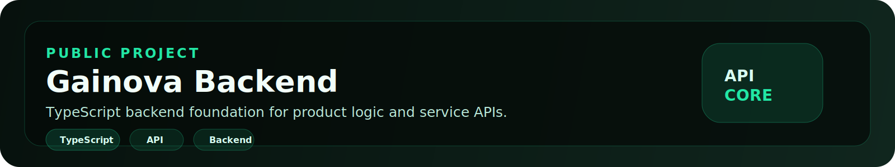
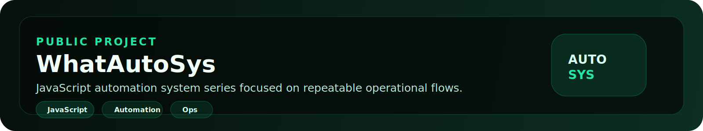
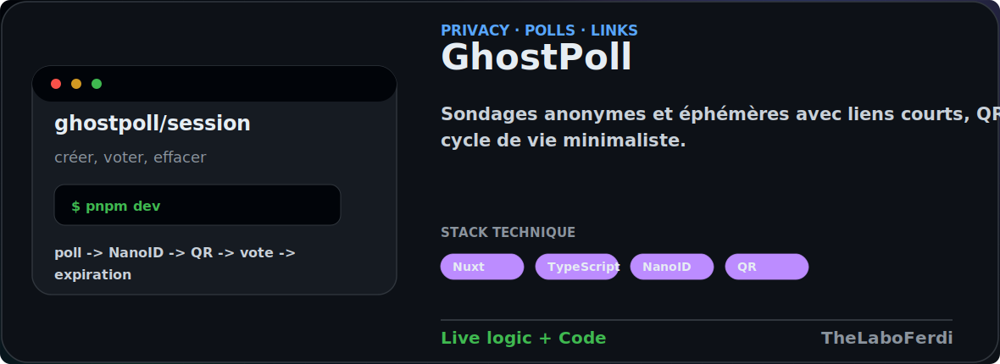
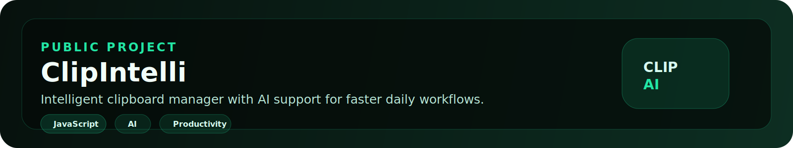
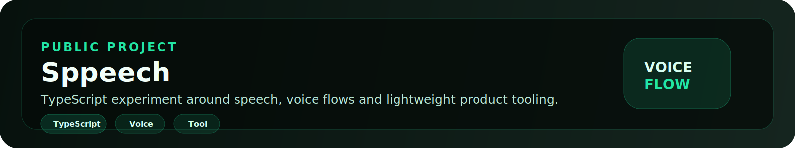
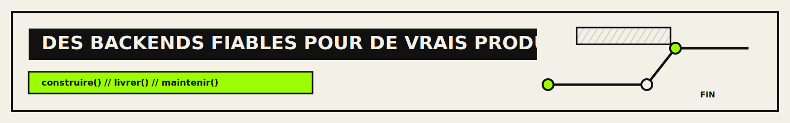

---

## `$ whoami`

---

## Backend Stack

---

## Backend Projects

<table>
  <tr>
    <td width="130" align="center">
      
    </td>
    <td>
      
    </td>
  </tr>
</table>

  
  
  
  

<table>
  <tr>
    <td width="130" align="center"><strong>API</strong> no public logo</td>
    <td>
      
    </td>
  </tr>
</table>

  
  
  

<table>
  <tr>
    <td width="130" align="center"><strong>API</strong> no public logo</td>
    <td>
      
    </td>
  </tr>
</table>

  
  
  

<table>
  <tr>
    <td width="130" align="center">
      
    </td>
    <td>
      
    </td>
  </tr>
</table>

  
  
  
  

<table>
  <tr>
    <td width="130" align="center">
      
    </td>
    <td>
      
    </td>
  </tr>
</table>

  
  
  

<table>
  <tr>
    <td width="130" align="center">
      
    </td>
    <td>
      
    </td>
  </tr>
</table>

  
  
  

<table>
  <tr>
    <td width="130" align="center"><strong>API</strong> no public logo</td>
    <td>
      
    </td>
  </tr>
</table>

  
  
  

---

## GitHub Signals

  

---

## Backend Focus

- Designing APIs with clear contracts, validation, auth, rate limiting and predictable error handling.
- Building service cores in Python, TypeScript, Rust, Go and Node depending on the job.
- Working with Postgres, SQLite, Redis, queues, workers, WebSockets and automation engines.
- Shipping Dockerized backends with CI, observability and production-minded structure.
- Turning product ideas into reliable backend foundations before polishing the interface.

---

## Contact

 

