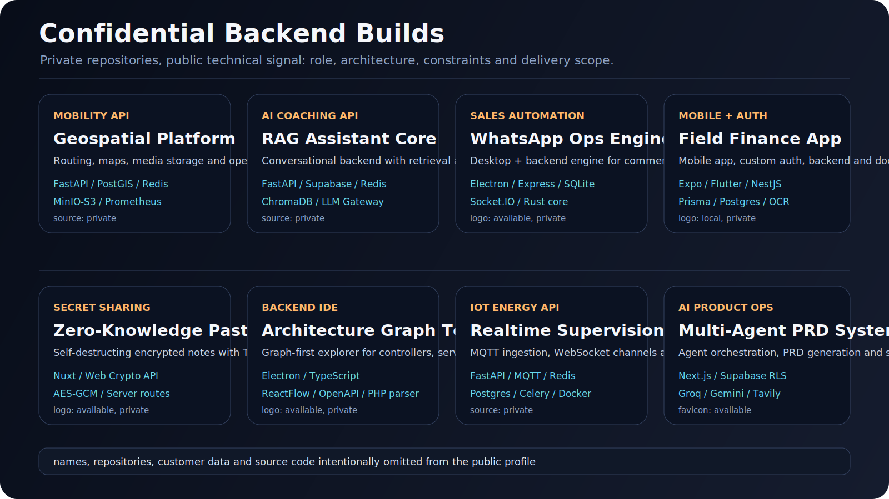
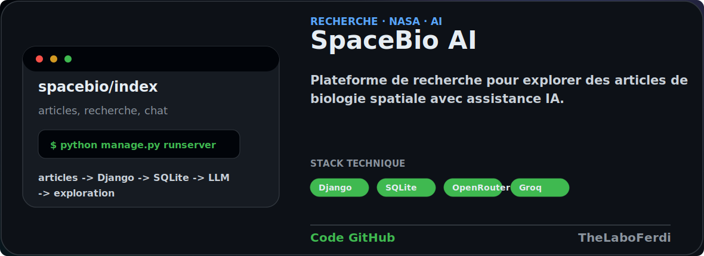

---

## `$ whoami`

---

## Stack Backend

---

## Les Combos, En Clair

- `FastAPI + PostgreSQL + Redis` : une API Python rapide, une base solide, et du cache pour garder de bonnes performances.
- `NestJS + Prisma + PostgreSQL` : un backend TypeScript structuré, facile à maintenir, avec une base de données propre.
- `Express + Socket.IO + SQLite` : une app desktop ou locale qui discute en temps réel avec son backend.
- `MQTT + WebSocket + Celery` : des données d'objets connectés qui remontent en direct, avec des tâches en arrière-plan.
- `Supabase + RLS + Next.js` : un produit web avec authentification, base de données et règles d'accès côté serveur.

---

## Projets Clients Confidentiels

  
  
  

> Les sources et les noms clients restent privés. Je montre uniquement le rôle, l'architecture et le résultat technique.

---

## Projets Publics

<table>
  <tr>
    <td width="130" align="center">
      
    </td>
    <td>
      
    </td>
  </tr>
</table>

  
  
  
  

<table>
  <tr>
    <td width="130" align="center">
      
    </td>
    <td>
      
    </td>
  </tr>
</table>

  
  
  
  

<table>
  <tr>
    <td width="130" align="center">
      
    </td>
    <td>
      
    </td>
  </tr>
</table>

  
  
  

<table>
  <tr>
    <td width="130" align="center">
      
    </td>
    <td>
      
    </td>
  </tr>
</table>

  
  
  

  
  
  

---

## Signaux GitHub

  

---

## Ce Que Je Construis

- Des APIs propres avec authentification, validation, droits d'accès et erreurs prévisibles.
- Des backends Python, TypeScript, Node, Rust ou Go selon le besoin réel du projet.
- Des bases de données bien pensées : PostgreSQL, SQLite, Redis, Supabase, stockage fichiers.
- Des systèmes temps réel : WebSocket, MQTT, workers, queues et automatisations.
- Des fondations backend fiables avant de polir l'interface utilisateur.

---

## Contact

 

