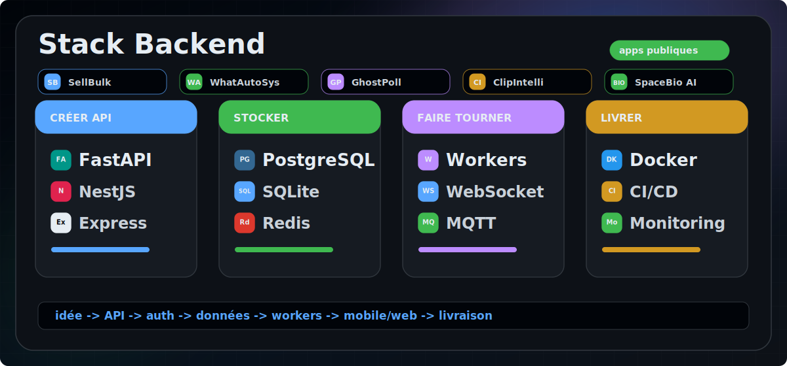
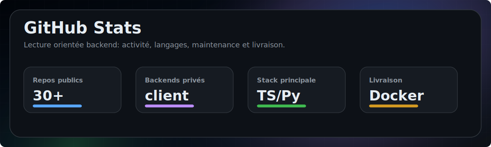
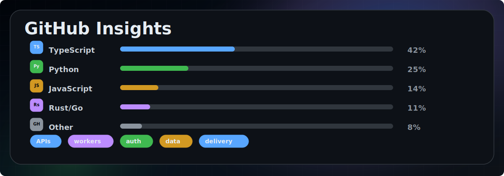
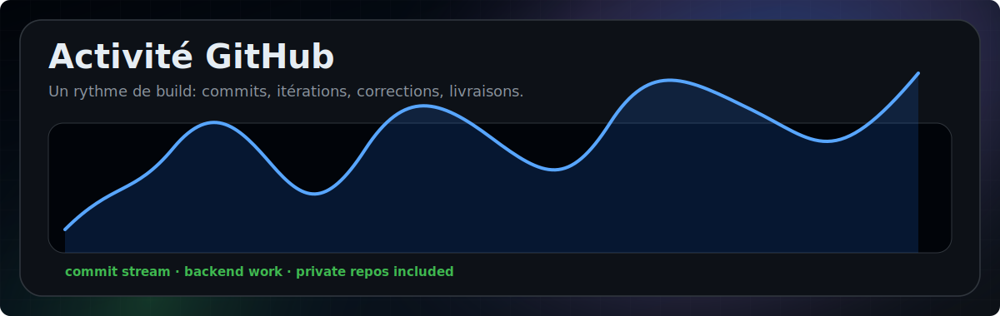
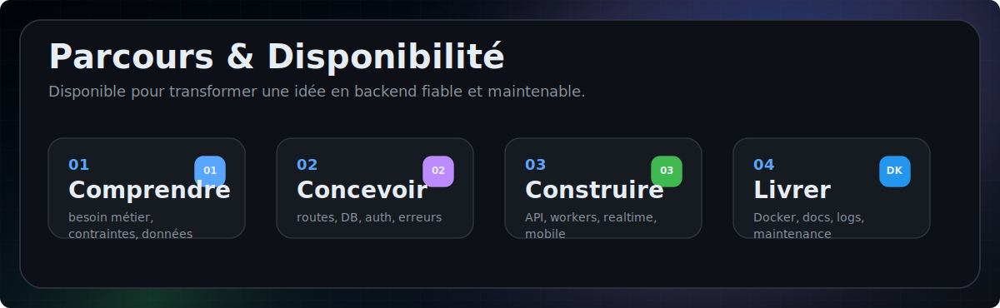

 

---

## `$ whoami`

---

## Stack Backend

---

## Projets Publics

  
  
  

  
  
  

  
  
  

  
  
  

  
  
  

---

## Projets Clients Confidentiels

  
  
  

---

## GitHub Stats

  

  

---

## Parcours & Disponibilité

---

## Derniers Axes De Travail

- APIs backend avec authentification, validation, droits d'accès et erreurs prévisibles.
- Backends Python, TypeScript, Node, Rust ou Go selon le vrai besoin du projet.
- Données solides: PostgreSQL, SQLite, Redis, Supabase, fichiers et migrations.
- Systèmes temps réel: WebSocket, Socket.IO, MQTT, workers, queues et automatisations.
- Livraison propre: Docker, Compose, documentation, logs et bases maintenables.

---

## Contact

 

